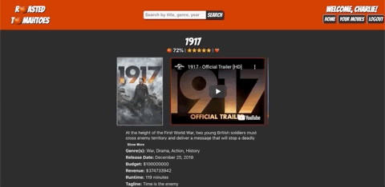

# [Roasted Tomahtoes](https://roastedtomahtoes.herokuapp.com/) - Readme
Mod 3 Paired Project
### Authors: [Greyson Elkins](https://github.com/GreysonElkins) & [Leigh Larson](https://github.com/leighlars)

- [Deployed Pages](https://roastedtomahtoes.herokuapp.com/)
- [Repo](https://github.com/GreysonElkins/roasted-tomahtoes)
- [Project Board](https://github.com/GreysonElkins/roasted-tomahtoes/projects)
- [Project Spec](https://frontend.turing.io/projects/module-3/rancid-tomatillos-v2.html)

## Abstract 

Roasted Tomahtoes is a sensible, aesthetically engaging, and user friendly movie review app. The user can log-in, read about movies, watch movie trailers, rate movies the user loved or hated, and search by a variety of criteria. 

## Technologies / Systems 

- React
- React Router
- JSX
- ECMAScript 6 
- ESLint
- TDD with Jest
- VSCode 
- git / Version control
- SCSS / SASS
- API Fetch

## Set Up 

To interact with the app without cloning / downloading the file, click [here](https://roastedtomahtoes.herokuapp.com/). 

1. Fork and clone down this repo
2. Once you have cloned the repo, change into the directory and install the project dependencies by running `npm install`.
3. To verify that it is setup correctly, run `npm start` in your terminal. Go to `http://localhost:3000/` to interact with the application. 
4. To log in, use the email `charlie@turing.io` and password `qwerty`
5. Rate stars, read about movies, watch movie trailers-- explore! 
6. Enter `control + c` in your terminal to stop the server at any time.

If you'd like to work on the server-side of the project (which handles favorites and comments) - a repo for the server can be found [here](https://github.com/GreysonElkins/roasted-tomhatoes-suplemental-server). It is not routed to heroku and any changes to the live version will have to be made by Greyson Elkins, but has room for improvements. To use the repo version in the app, reassign `localHost` to `https://localHost:5000/api/v1` and follow the instructions in the readme for the repo linked above. 

## Gif Showcase

 
*Viewing guest home view, incorrect & correct login*

 
*Viewing single movie page with trailers, info, and comment section*

 
*Searching various movies*

 
*Display user's movies, favoriting and unfavoriting movies*

 
*Sort by genre and show loading gif*

 
*Viewing comments added to movie*

 
*When logged in, user can rate and comment, but cannot as a guest*

## Reflections

This project introduced our paired team to React.js and Router. We feel we have demonstrated our understanding of these technologies by satisfying all demands of the spec, as well as completing all extensions, and even adding our own features to the UI (like the horizontal scrolling components), all while maintaining a 97% Accessibility score. We implemented TDD using Jest to test for UX and async elements. If we had more time, we would have styled the app mobile-friendly, made the emoji's accessible, fixed a bug that caused our page to load the home page when the refresh button is clicked, added more tests, and displayed all comments about movies from the community (not just the user).  Our project documentation can be viewed on [Project Board](https://github.com/GreysonElkins/roasted-tomahtoes/projects) and in the aforementioned gif section. We worked well together and really crushed this introductory React project. 

